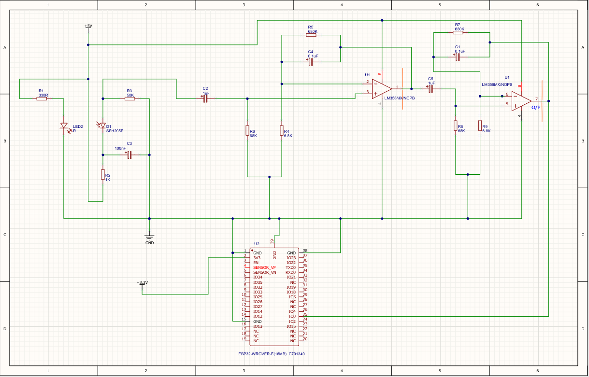

# Non-invasive glucose monitoring system

Monitoring of glucose level of blood is important to avoid complications of diabetic and damage to organs. Since invasive
method of glucose level measurement is painful and causes damage to nerves, non-invasive method is used as an alternative.
So, it is simple circuit diagram or schematic of "Non- invasive glucose monitoring system" using ESP32.

### Circuit diagram or schematic

